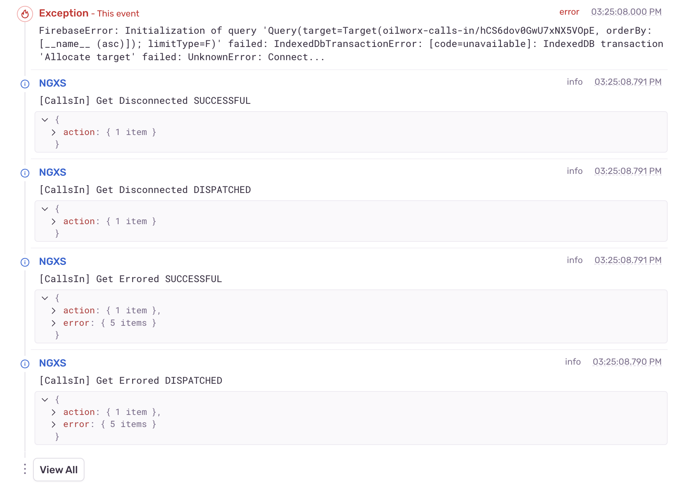

# Integration with Sentry

If you are using Sentry as your Error Tracker, you can use this recipe to trace and log actions as *breadcrumbs*.

First you'll need to initialize Sentry in your app using `Sentry.init(...)` in the `main.ts` file.

```ts
Sentry.init({
  dsn: ...
  // ...
});
``` 

Next, you need to provide `Sentry`'s `ErrorHandler` and `TraceService`.

```ts
// app.module.ts
@NgModule({
  providers: [
    // ...
    {
      provide: ErrorHandler,
      useValue: Sentry.createErrorHandler(),
    },
    {
      provide: Sentry.TraceService,
      deps: [Router],
    },
    {
      provide: APP_INITIALIZER,
      useFactory: () => () => {},
      deps: [Sentry.TraceService],
      multi: true,
    },
  ],  
})
export class AppModule {}

//app.config.ts
export const appConfig: ApplicationConfig = {
  providers: [
    // ...
    {
      provide: ErrorHandler,
      useValue: Sentry.createErrorHandler(),
    },
    {
      provide: Sentry.TraceService,
      deps: [Router],
    },
    {
      provide: APP_INITIALIZER,
      useFactory: () => () => {},
      deps: [Sentry.TraceService],
      multi: true,
    },
  ],
};
//or
bootstrapApplication(App, {
  providers: [
    //...
    provideAppInitializer(() => inject(Sentry.TraceService))
  ],
});
```

Now, let's go over how to log NGXS actions as breadcrumbs.
Create a service `NgxsSentryBreadcrumbsService`. 
This service uses NGXS `Actions` dependency to listen to all events and send them to Sentry using `Sentry.addBreadcrumb`.

```ts
@Injectable({providedIn:root})
export class NgxsSentryBreadcrumbsService implements OnDestroy {
  #actions = inject(Actions);
  #destroyed$ = new Subject<void>();

  constructor() {
    this.#subscribeToActions();
  }

  #subscribeToActions() {
    const excludeAction = [] //You can add the actions you want to exclude from your breadcrumbs here;
    this.#actions.subscribe(
      (ctx) => {
        const actionType = getActionTypeFromInstance(ctx.action);
        if (actionType && !excludeActions.some((excludeAction) => actionType.startsWith(excludeAction))) {
          Sentry.addBreadcrumb({
            category: 'NGXS',
            message: `${actionType} ${ctx.status}`,
            level: 'info',
            type: 'info',
            data: typeof ctx.action === 'string' ? { data: ctx.action } : ctx.action,
          });
        }
      }
    );
  }

  ngOnDestroy() {
    this.#destroyed$.next();
  }
}
```

Lastly provide the `NgxsSentryBreadcrumbsService` and include it as dependency of the `APP_INITIALIZER`, this will allow to instantiate the service when the app initializes and starts monitoring and tracing actions as breadcrumns to Sentry.

```ts
{
  provide: NgxsSentryBreadcrumbsService,
  useClass: NgxsSentryBreadcrumbsService,
},
{
  provide: APP_INITIALIZER,
  useFactory: () => () => {},
  deps: [NgxsSentryBreadcrumbsService],
  multi: true,
}
// or 
bootstrapApplication(App, {
  providers: [
    //...
    provideAppInitializer(() => inject(NgxsSentryBreadcrumbsService))
  ],
});
```

That's it! This is a simple implementation on how to integrate NGXS and Sentry to trace actions as breadcrumbs. This will result in Sentry displaying the executed actions previous to an error.


